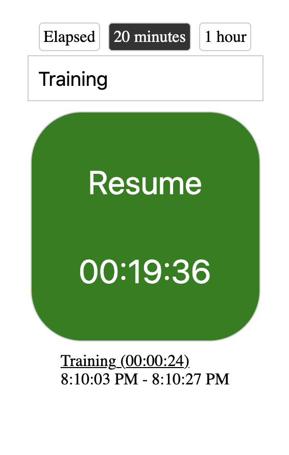
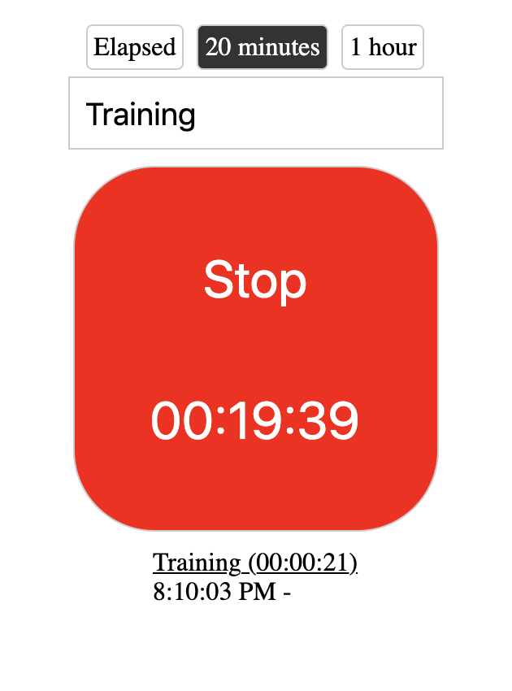

# Interval Tracker
PWA experiment using [Parcel.js](https://parceljs.org/), [ReactJS](https://reactjs.org/), and [TypeScript](https://www.typescriptlang.org/)




## Installation
```
git clone git@github.com:emeraldwalk/interval-tracker.git
```

```
yarn
```

## Running Locally

```
yarn start
```